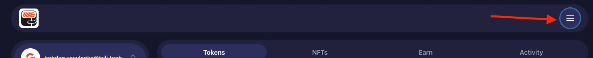
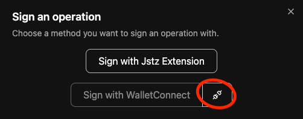
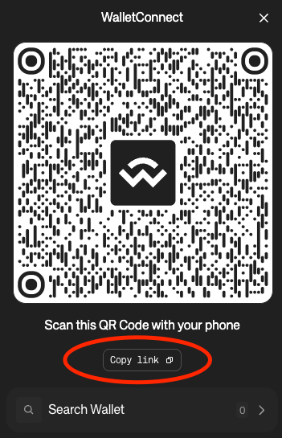
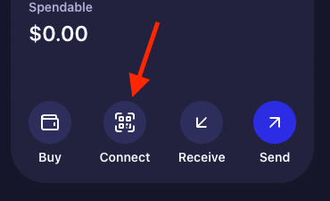
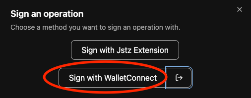
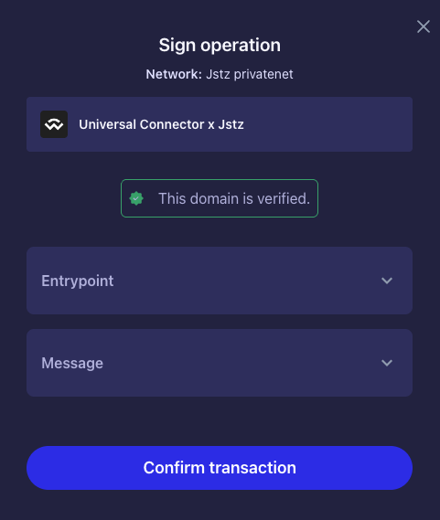

# Signing Jstz operations with [Umami](https://www.umamiwallet.com/) wallet through [WalletConnect](https://walletconnect.com/)

Jstz is collaborating with the Umami wallet team to support signing of the Jstz operations. 

> **Warning!**
> Currently Jstz support is in development and is available only on the specific preview deployment URL of the Umami dev wallet 

### Connecting Jstz and Umami
1. Go to [Umami wallet preview deployment with Jstz support](https://umami-v2-web-git-feat-jstz-890-signing-trili-tech.vercel.app/) and sign in
2. On the Umami dashboard click on the menu button 
3. Under the `Network` tab, make sure you have `Jstz Privatenet` enabled (tip: you can disable other networks as they will throw errors in the preview environment)
4. On the Jstz dashboard, when prompted with signing method click on the connect button next to `Sign with Umami` button

5. On the WalletConnect popup click `Copy link`
   
6. On the Umami dashboard click the `Connect` button then select your account from the dropdown menu and confirm
   
7. On the Jstz Dashboard the `Sign with Umami` button should become active

### Signing Jstz operation with Umami
If you followed the previous step properly you should be able to sign the operation with your dev Umami wallet.
1. Click `Sign with Umami` button
   
2. On the Umami dashboard, the signing confirmation popup should show up
   
3. After confirmation, It will take a couple of seconds for the operation to be signed and injected
